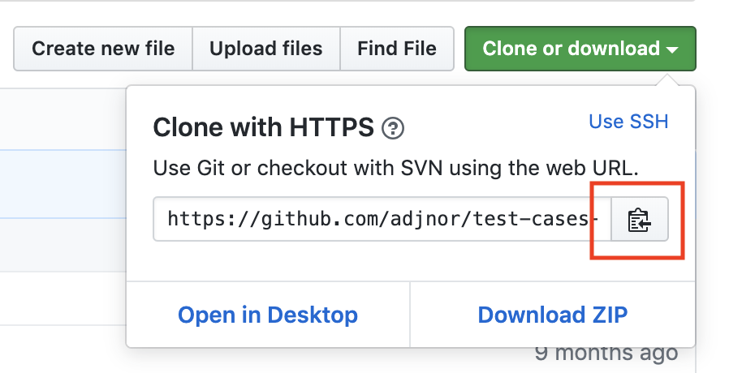

# Instructions

First, fork this repository, then follow the instructions

1. Copy the link to the repository by clicking on the button.
2. Open the terminal and make sure you are in the Decode folder (the one where you have the html-css-workshop folder)
3. Do the following commands (you need to replace LINK_YOU_COPIED with the link for your forked repository):
   - git clone LINK_YOU_COPIED
   - cd test-cases-and-debugging
   - npm install
     - This installs external packages needed for the workshop. If this does not work, you'll need to install [node](https://nodejs.org/en/download/)
   - code .

1. Open the debugger view
2. Open the debugger configuration
3. Change the file to be the one you're working on. Leave it to problem1 for the first exercise
4. Run the test for the specified problem when you think you're done
