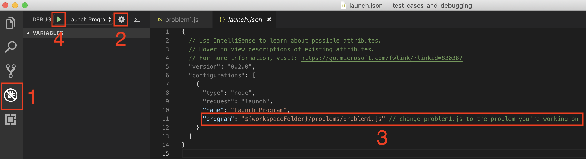

# Instructions

1. Open the debugger view
2. Open the debugger configuration
3. Change the file to be the one you're working on. Leave it to problem1 for the first exercise
4. Run the test for the specified problem when you think you're done
